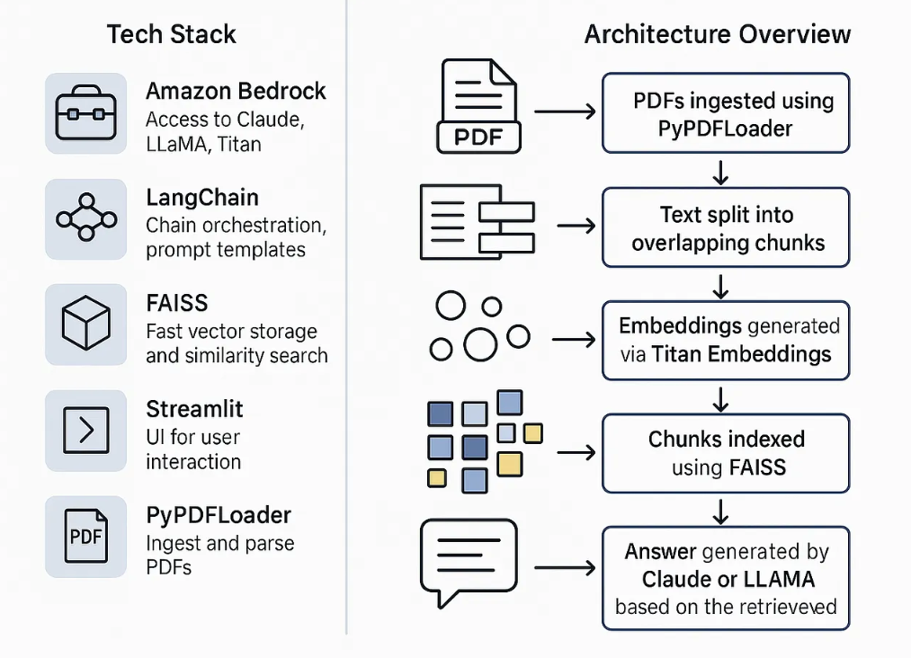
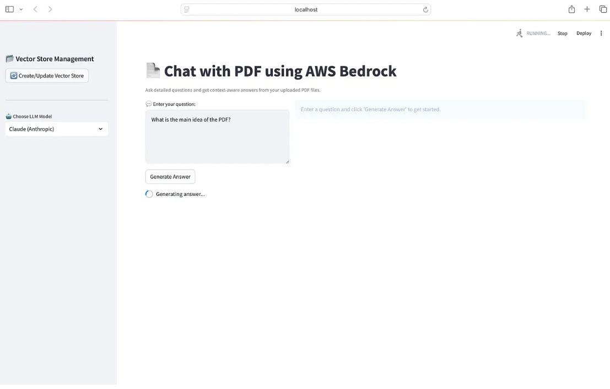

# 🤖 Chat With Your PDFs Using AWS Bedrock, LangChain, and Streamlit

This project allows you to **chat with PDF documents using natural language**, powered by **Amazon Bedrock (Claude, LLaMA 3)** and **Titan Embeddings**. It leverages **LangChain** for RAG-based document processing, **FAISS** for vector search, and an elegant **Streamlit UI** for real-time Q&A.

---

## 🔍 Features

- 🧠 **Ask Questions** from single or multiple PDFs
- ⚙️ **Choose LLMs** – Claude v2 or LLaMA 3 via AWS Bedrock
- 📌 **Titan Embeddings** for vectorization
- 🔍 **Semantic Search** using FAISS instead of keyword match
- 📄 **Context-Aware Summarization** (250+ words)
- 🖥️ **Intuitive Streamlit UI** with file upload, chat, and model control
- 🗂️ **Manage Vector Stores** via sidebar

---

## 🧠 Why This Project?

Traditional PDF tools are static and require exact keyword matches. This project uses **Retrieval-Augmented Generation (RAG)**, combining:

- Your private PDFs (as context)
- Embeddings via **Titan**
- LLMs from **Amazon Bedrock**

This creates an experience where you can query documents as if you're talking to a human.

---

## 🏗️ Architecture

1. **PDFs Ingested** via `PyPDFDirectoryLoader`
2. **Text Chunked** using LangChain's splitters
3. **Embeddings Created** via **Titan Embeddings**
4. **Chunks Indexed** with **FAISS**
5. **User Query** is embedded and compared to stored vectors
6. **LLM Generates** a response using context (Claude or LLaMA 3)

### 🧱 Architecture Diagram



---

## 🖥️ User Interface

- Drag-and-drop PDFs
- Select LLM (Claude or LLaMA 3)
- Ask questions
- Receive streamed answers with references

### 🖼️ UI Preview



---

## 🚀 Getting Started

### ✅ Prerequisites

- Python 3.10+
- AWS credentials with Bedrock access
- Streamlit and Python packages (see `requirements.txt`)

---

### ⚙️ Installation

```bash
# Clone the repository
git clone https://github.com/KarthickRio/Chat_with_pdf_using_AWS_Bedrock.git
cd Chat_with_pdf_using_AWS_Bedrock

# Create virtual environment
python -m venv venv
venv\Scripts\activate  # On Windows

# Install dependencies
pip install -r requirements.txt
